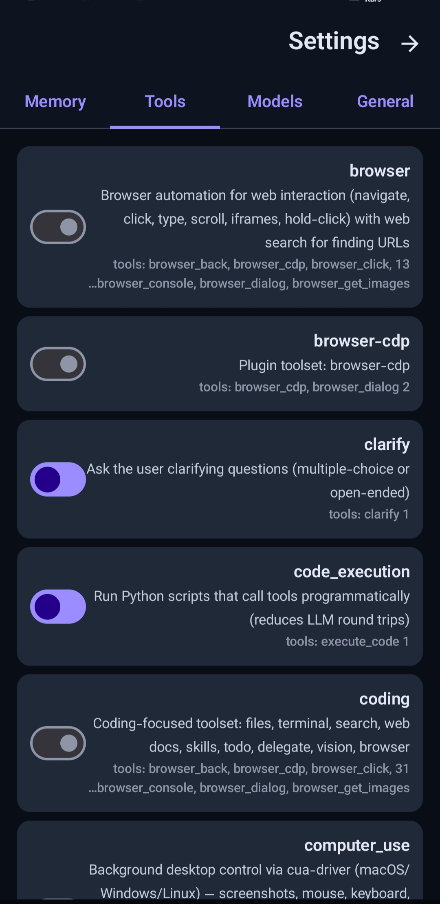

<p align="center">
  
  <br><br>
  <b>اپ نیتیو اندروید برای Hermes Agent</b>
  <br>
  <sub>یک اتاق فرمان متمرکز برای ایجنت هوش مصنوعی — کاملاً روی گوشی خودت.</sub>
  <br><br>
  <a href="https://github.com/traveler3022/Hermes2/actions/workflows/build-apk.yml"></a>
  <a href="https://github.com/traveler3022/Hermes2/releases/latest"></a>
  <a href="LICENSE"></a>
  <br><br>
  <a href="README.md">English</a> · <a href="README.fa.md">فارسی</a>
</p>

<div dir="rtl">

---

## این چیه؟

**[Hermes Agent](https://github.com/NousResearch/hermes-agent)** یک ایجنت هوش مصنوعی متن‌باز از [Nous Research](https://nousresearch.com) است که به‌صورت محلی روی دستگاه خودت اجرا می‌شود. کد می‌نویسد، دستور اجرا می‌کند، فایل مدیریت می‌کند، وب را جست‌وجو می‌کند، کارها را به زیرایجنت‌ها می‌سپارد و به ده‌ها ابزار و سرویس وصل می‌شود.

**Hermes2** همان ایجنت را به اندروید می‌آورد — به‌شکل یک اپ نیتیو با طراحی Material 3. اپ فقط رابط کاربری است؛ مغز ماجرا خودِ Hermes است که داخل Termux اجرا می‌شود. تمام ارتباط بین این دو، روی گوشی خودت می‌ماند.

> **بدون واسطه‌ی ابری · بدون حساب کاربری · بدون تله‌متری**

---

## 💪 قابلیت‌ها

- 💬 **چت زنده** با پاسخ‌های استریم، نمایش استدلال مدل، و کارت‌های فراخوانی ابزار
- 🗂️ **مدیریت سشن** — جست‌وجو، سنجاق‌کردن، تغییر نام و ادامه‌ی هر گفت‌وگوی قبلی
- ✅ **تأیید ابزار** به‌صورت اعلان اندروید — قبل از اجرای هر دستور، Approve یا Deny کن
- ⚙️ **Runtime Setup** — تشخیص، نصب و اجرای gateway هرمس از داخل خود اپ
- 🎨 **۶ تم رنگی**، حالت روشن/تاریک/سیستم، طراحی کامل Material 3
- 🌐 **دوزبانه** — رابط کاربری و راه‌اندازی به انگلیسی و فارسی
- 🔋 **Foreground service** — gateway حتی وقتی صفحه خاموش است زنده می‌ماند
- 📤 **Share intent** — از هر اپی متن را مستقیم به چت Hermes2 بفرست

---

## 🛡️ حریم خصوصی و امنیت

**چی روی گوشی می‌ماند:** کلید API تو در تنظیمات Hermes داخل Termux ذخیره می‌شود. ارتباط اپ با ایجنت روی `127.0.0.1` (خودِ گوشی) برقرار می‌شود و هرگز از دستگاه خارج نمی‌شود.

**چی از گوشی خارج می‌شود:** پیام‌های تو به ارائه‌دهنده‌ی مدلی می‌رود که خودت انتخاب کرده‌ای (Gemini ← گوگل، OpenRouter ← سرویس‌های مختلف). هر API هوش مصنوعی همین‌طور کار می‌کند.

```
You → Hermes2 → AI Provider (مثلاً گوگل)
         │
         └─ کلید API فقط روی گوشی خودت می‌ماند ✅
```

> ⚠️ هرگز کلید API یا رمز عبورت را داخل چت ننویس — هر چیزی که تایپ کنی برای ارائه‌دهنده‌ی مدل فرستاده می‌شود.

**ایجنت چه کارهایی می‌تواند بکند:** Hermes دستورات شل را داخل Termux اجرا می‌کند. روی گوشی روت‌نشده، سندباکس اندروید این دسترسی را فقط به فضای ذخیره‌سازی Termux محدود می‌کند.

**تأیید ابزار را روشن نگه دار** — این خط دفاعی توست. هر جا شک داشتی، Deny بزن و از ایجنت بپرس دقیقاً قصد داشت چه کاری انجام بدهد.

---

## 🚀 شروع سریع

این راهنماها را **به ترتیب** دنبال کن — انتهای هر راهنما لینک مرحله‌ی بعد هست:

| مرحله | راهنما | چه کاری انجام می‌دهی |
|---|---|---|
| 1️⃣ | **[نصب هرمس در Termux](docs/INSTALL_HERMES_TERMUX.md)** | نصب Termux و بعد نصب Hermes Agent داخل آن (حدود ۱۵ دقیقه) |
| 2️⃣ | **[اجرای ویزارد راه‌اندازی](docs/SETUP_HERMES_TERMUX.md)** | تنظیم ارائه‌دهنده‌ی مدل و ابزارها با `hermes setup` |
| 3️⃣ | **[اتصال اپ](docs/GATEWAY_SETUP.md)** | نصب APK و اولین اتصال (فقط یک بار لازم است) |

**منابع بیشتر:**

| | |
|---|---|
| **[راهنمای فنی کامل](docs/RUNNING_ON_ANDROID_TERMUX.md)** | همه‌چیز یک‌جا: نصب، تنظیم، اتصال و عیب‌یابی |
| **[مستندات رسمی Hermes](https://hermes-agent.nousresearch.com/docs)** | مستندات پروژه‌ی بالادستی |

---

## 📸 اسکرین‌شات‌ها

<p align="center">
  
  
  
  
  
</p>

---

## ❓ سؤالات متداول

<details>
<summary><b>اپ روی «Connecting...» گیر کرده</b></summary>

اولین اجرا (استارت سرد) ۳۰ تا ۹۰ ثانیه طول می‌کشد. لاگ را ببین: `cat ~/.hermes/logs/gateway_stdout.log`
اگر هرمس در حال اجراست ولی اپ وصل نمی‌شود: Termux را force-stop کن، دوباره باز کن و gateway را از داخل اپ استارت بزن.
</details>

<details>
<summary><b>وقتی صفحه خاموش می‌شود اتصال قطع می‌شود</b></summary>

باتری Hermes2 (و Termux) را روی **بدون محدودیت** بگذار: تنظیمات ← برنامه‌ها ← [برنامه] ← باتری ← بدون محدودیت.
</details>

<details>
<summary><b>چه مدل‌هایی پشتیبانی می‌شوند؟</b></summary>

هر ارائه‌دهنده‌ی سازگار با OpenAI: Gemini، OpenRouter، Claude، Mistral، Groq، Ollama، DeepSeek و بیشتر.
</details>

---

## 🛠️ ساخت از سورس

</div>

```bash
git clone https://github.com/traveler3022/Hermes2.git
cd Hermes2
bash ./gradlew :app:assembleDebug
```

<div dir="rtl">

پیش‌نیازها: JDK 17 · Android SDK 35 · Android Studio Ladybug یا جدیدتر

---

## 🤝 مشارکت

Issue و PR خوش‌آمدند. این یک پورت مستقل و جامعه‌محور است — محصول رسمی Nous Research نیست. موقع گزارش باگ، لطفاً **نسخه‌ی اندروید**، **مدل گوشی** و خط‌های مرتبط از `~/.hermes/logs/gateway_stdout.log` را هم بنویس.

---

## 📄 لایسنس

**MIT** — فایل [LICENSE](LICENSE) را ببین.

<sub>پروژه‌ی مستقل · وابسته به Nous Research نیست · «Hermes Agent» متعلق به نویسندگان خودش است.</sub>

<p align="center">
  <br>
  <b>⬡ ساخته‌شده برای اندروید · با قدرت Hermes Agent ⬡</b>
</p>
</div>
