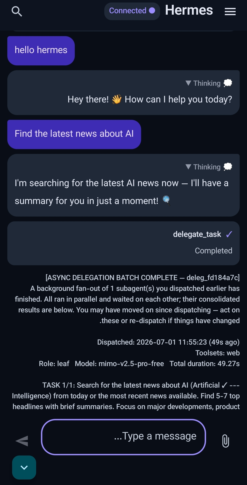
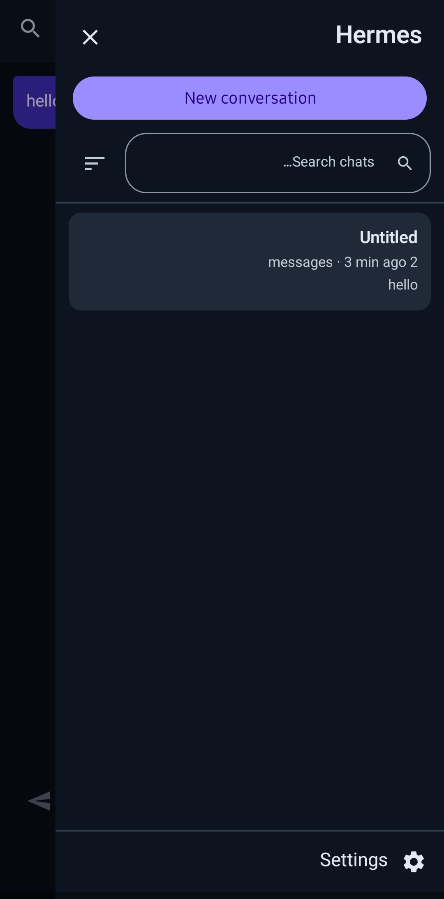
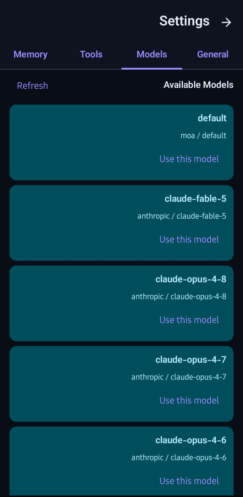
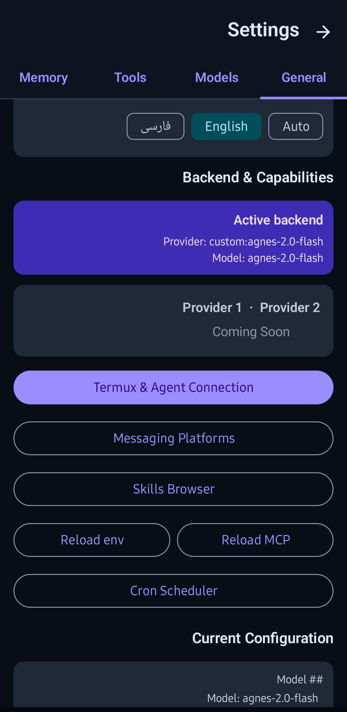

<p align="center">
  
  <br><br>
  <b>Native Android companion for Hermes Agent</b>
  <br>
  <sub>A focused control room for your AI agent — running entirely on your phone.</sub>
  <br><br>
  <a href="https://github.com/traveler3022/Hermes2/actions/workflows/build-apk.yml"></a>
  <a href="https://github.com/traveler3022/Hermes2/releases/tag/debug-latest"></a>
  <a href="LICENSE"></a>
  <br><br>
  <a href="README.md">English</a> · <a href="README.fa.md">فارسی</a>
</p>

---

## What is this?

**[Hermes Agent](https://github.com/NousResearch/hermes-agent)** is a powerful open-source AI agent by [Nous Research](https://nousresearch.com) that runs locally on your machine. It writes code, runs commands, manages files, browses the web, delegates to sub-agents, and connects to dozens of tools and services.

**Hermes2** brings that agent to Android as a native Material 3 app. The app is the front-end — Hermes running inside Termux is the brain. All communication stays on your phone.

> **No cloud middleman · No account · No telemetry**

---

## 💪 Features

- 💬 **Live chat** with streaming responses, reasoning view, and tool-call cards
- 🗂️ **Session management** — search, pin, rename, resume any past conversation
- ✅ **Tool approval** as Android notifications — Approve or Deny before anything runs
- ⚙️ **Runtime Setup** — detect, install, and start the Hermes gateway from the app
- 🎨 **6 color themes**, light/dark/system modes, full Material 3 design
- 🌐 **Bilingual** — English and فارسی onboarding and UI
- 🔋 **Foreground service** — keeps the gateway alive when the screen is off
- 📤 **Share intent** — send text from any app into Hermes2 chat

---

## 🛡️ Privacy & Security

**Stays on your phone:** Your API key lives in Hermes' config inside Termux. The app-to-agent link runs over `127.0.0.1` — it never leaves the device.

**Leaves your phone:** Your messages go to the model provider you chose (Gemini → Google, OpenRouter → various). That's how any AI API works.

```
You → Hermes2 → AI Provider (e.g. Google)
         │
         └─ API key stays on your phone ✅
```

> ⚠️ Never share your API key or passwords in the chat — everything you type goes to the AI provider.

**What the agent can do:** Hermes runs shell commands inside Termux. On a non-rooted phone, Android's sandbox confines this to Termux's storage only.

> ⚠️ **Do not root your phone to run this.** Rooting removes the sandbox.

**Keep tool approval on** — it's your line of defense. When in doubt, Deny and ask the agent what it planned to do.

---

## 📚 Documentation

| | |
|---|---|
| **[Setup Guide](docs/RUNNING_ON_ANDROID_TERMUX.md)** | Complete install, config, first connection, and debugging |
| **[Install in Termux](docs/INSTALL_HERMES_TERMUX.md)** | Step-by-step Termux installation |
| **[Setup Wizard](docs/SETUP_HERMES_TERMUX.md)** | Guide to the `hermes setup` wizard |
| **[First Connection](docs/GATEWAY_SETUP.md)** | Connect the app to Hermes for the first time |
| **[Hermes Agent Docs](https://hermes-agent.nousresearch.com/docs)** | Official upstream documentation |

---

## 📸 Screenshots

<p align="center">
  
  
  
  
  
</p>

---

## ❓ FAQ

<details>
<summary><b>App stuck on "Connecting..."</b></summary>

Cold-start takes 30–90 s. Check logs: `cat ~/.hermes/logs/gateway_stdout.log`
If Hermes is running but the app won't connect: force-stop and reopen Termux, then start the gateway again.
</details>

<details>
<summary><b>Disconnects when screen turns off</b></summary>

Set Hermes2 (and Termux) to **Unrestricted** battery: Settings → Apps → [app] → Battery → Unrestricted.
</details>

<details>
<summary><b>What models are supported?</b></summary>

Any OpenAI-compatible provider: Gemini, OpenRouter, Claude, Mistral, Groq, Ollama, DeepSeek, and more.
</details>

---

## 🛠️ Build from Source

```bash
git clone https://github.com/traveler3022/Hermes2.git
cd Hermes2
bash ./gradlew :app:assembleDebug
```

Requires: JDK 17 · Android SDK 35 · Android Studio Ladybug+

---

## 🤝 Contributing

Issues and PRs welcome. This is an independent community port — not an official Nous Research product. When reporting bugs, include your **Android version**, **phone model**, and relevant lines from `~/.hermes/logs/gateway_stdout.log`.

---

## 📄 License

**MIT** — see [LICENSE](LICENSE).

<sub>Independent project · not affiliated with Nous Research · "Hermes Agent" belongs to its respective authors.</sub>

<p align="center">
  <br>
  <b>⬡ Built for Android · Powered by Hermes Agent ⬡</b>
</p>
